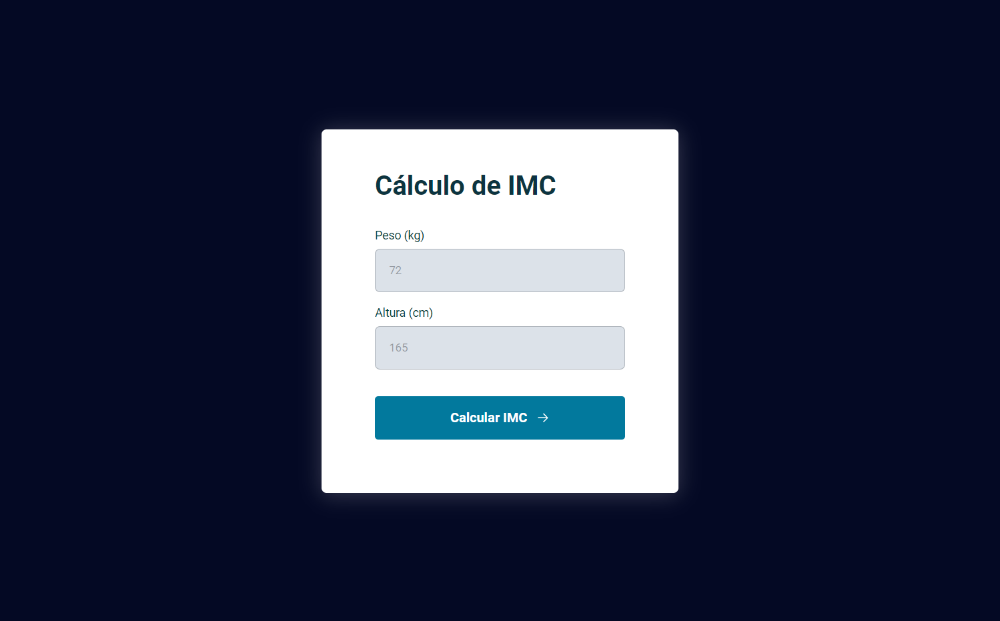

# Calculadora de IMC

> Projeto: Cálculo de IMC

Exercício construído no curso da Explorer da plataforma Rocketseat. 
Esse exercício se basea em uma calculadora que realiza a conta do IMC de certa pessoa.

[🔗 Clique aqui para acessar](https://kyochi7.github.io/jogo-adivinhacao-js/)

## 🧰 Tecnologias

- HTML
- CSS
- JavaScript
- Git e Github

## 📧 Contato

michigamidaniel77@gmail.com
